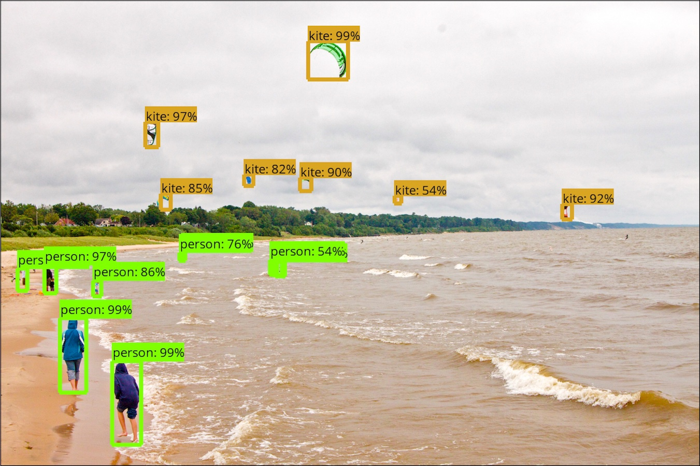

# Tensorflow Object Detection API
Creating accurate machine learning models capable of localizing and identifying
multiple objects in a single image remains a core challenge in computer vision.
The TensorFlow Object Detection API is an open source framework built on top of
TensorFlow that makes it easy to construct, train and deploy object detection
models.

  

## Description
Object recognition is a computer vision technique for identifying objects in images or videos. Object recognition is a key output of deep learning and machine learning algorithms.

As part of Opencv 3.4.+ deep neural network(dnn) module was included officially. The dnn module allows load pre-trained models from most populars deep learning frameworks, including Tensorflow, Caffe, Darknet, Torch. Besides MobileNet-SDD other architectures are compatible with OpenCV 3.4.1 :

* GoogleLeNet
* YOLO
* SqueezeNet
* Faster R-CNN
* ResNet
This API is compatible with C++ and Python.
